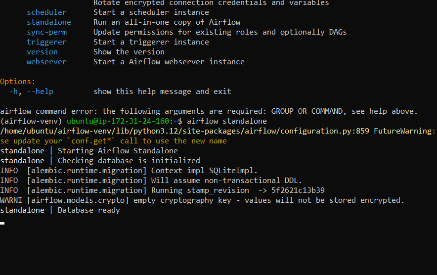
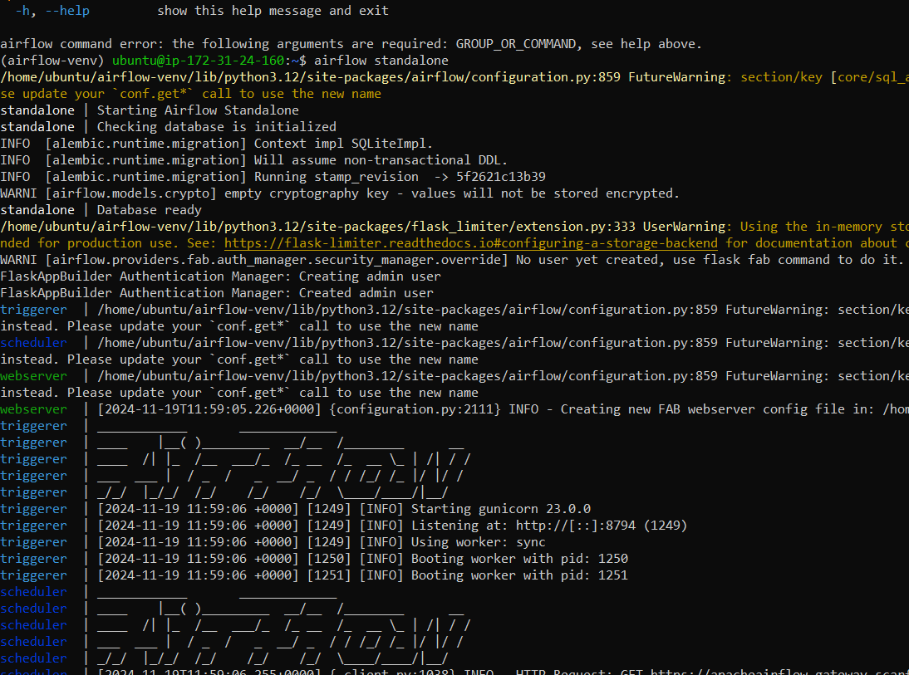
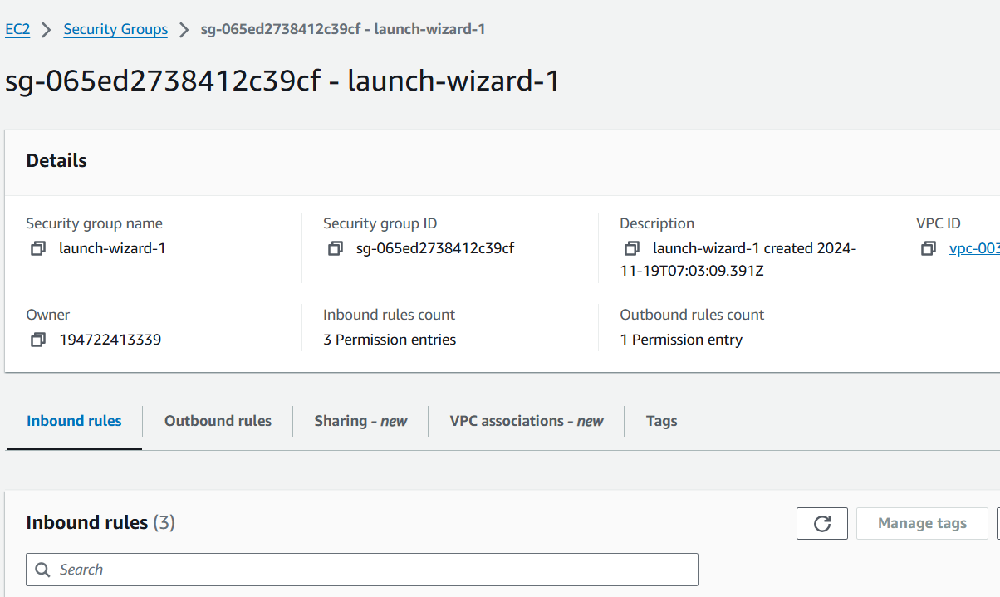
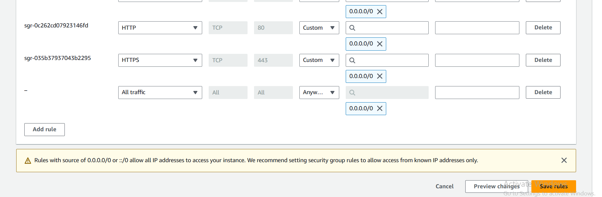
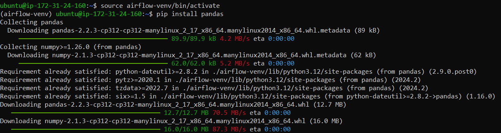

download the keys

connect to airflow instance and connect to ssh client
if you are using windows first change the permissions of the .pem file that you have downloaded
i am leaving a yt video for the help https://www.youtube.com/watch?v=hDE3Io5CIbc&ab_channel=TapanDubey

then install the commands given in the yt_etl.ssh file

installing on python virtual environment

pandas installing

