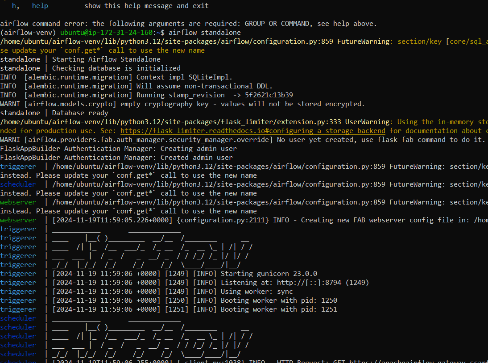
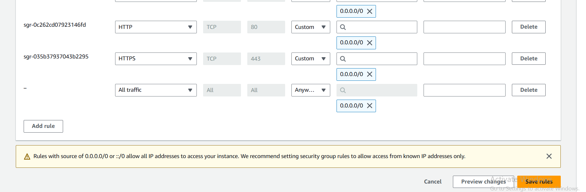
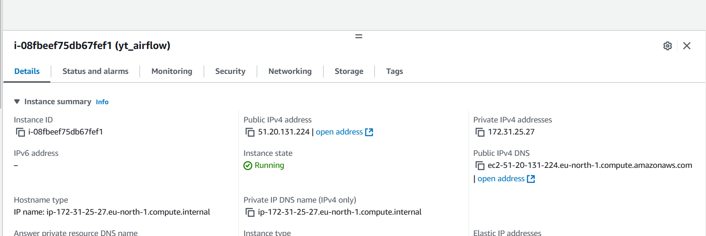
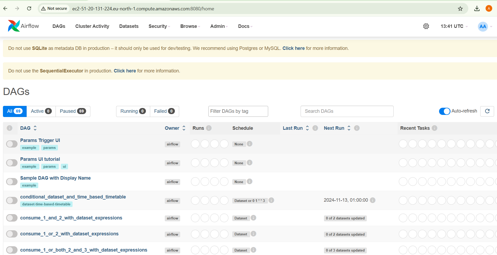
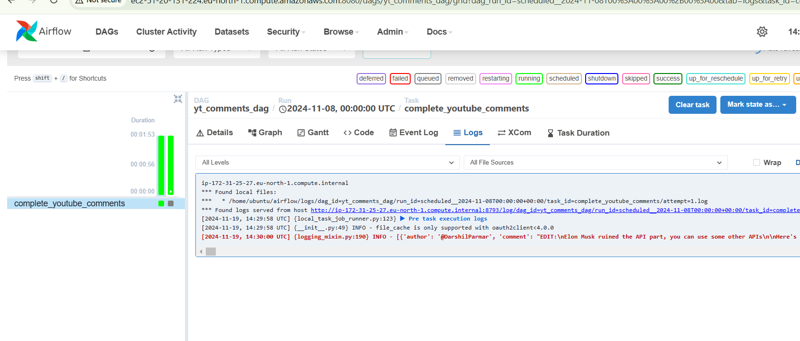

Here is the architecture diagram for the project

first you have to acquire youtube api key for extracting the commments from the youtube video that you want
here is the guide for getting the youtube api key
here is the guide for that
https://developers.google.com/youtube/v3/getting-started

download the keys

connect to airflow instance and connect to ssh client
if you are using windows first change the permissions of the .pem of key pair file that you have downloaded
i am leaving a yt video for the help https://www.youtube.com/watch?v=hDE3Io5CIbc&ab_channel=TapanDubey

Update Your Instance

sudo apt update && sudo apt upgrade -y 3. Install Required Dependencies
Airflow requires Python and some additional packages:

sudo apt install -y python3-pip python3-venv libpq-dev

4. Create a Virtual Environment
   To avoid interfering with the system Python environment, create an isolated virtual environment for Airflow:

python3 -m venv airflow-venv

Activate the virtual environment:

source airflow-venv/bin/activate 5. Install Apache Airflow
Install Airflow within the virtual environment:

pip install apache-airflow

6. Verify the Installation
   Ensure Airflow was installed correctly:

airflow version

then install the libraries from commands given in the yt_etl.ssh file

installing on python virtual environment

pandas installing

run command to runn airflow
airflow standalone

airflow not running? go into security groups in your instance
intace -> security -> edit inbound rules -> add rule with type all traffic with protocol anywhere or MyIP

allow all the traffic and ipv4 anywhere

now use this public ipv4 dns for running airfow instace

use link with endpoint :8080 with ipv4 public DNS
e.g ec2-51-20-131-224.eu-north-1.compute.amazonaws.com:8080

if you cant find the username and password in airflow logs on your cmd

create a new user using command
like mine:

flask fab create-admin --username areeb02 --firstname areebb --lastname ahmad -
-email admin11@example.com --password admin

you would be able to login the airflow

on your airflow ssh client go to /airflow
do sudo nano ariflow.cfg
and change the dags folder form dags to yt_comments dag or whatever suits your project
it will be someting like this

now copy the next 2 files using sudo nano commands in the yt_comments_dags folder
just like the commands shown below

now go to airflow UI
make sure the folder name in airflow directory for dags and the name of folder in path in airflow.cfg file is same.

now its possible that you your dag will give you error because you are trying to acceess the s3 bucket but you dont have iam role assigned to it you can do is

Choose the instance you want to attach the IAM role to
Select Actions, then Security, then Modify IAM role
Select the IAM instance profile
Select Update IAM role
and create iam role and give full s3 bucket permissions to it

now refresh your airflow UI
the dag appears dag appears like this

you cn check the logs for the print here in the logs tab

the csv has also been loaded to the specified s3 bucket

