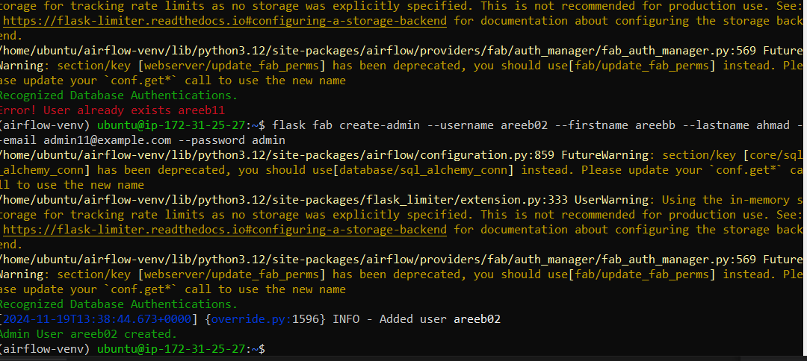
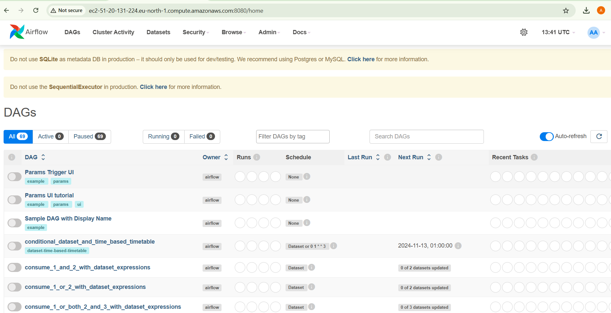

download the keys

connect to airflow instance and connect to ssh client
if you are using windows first change the permissions of the .pem of key pair file that you have downloaded
i am leaving a yt video for the help https://www.youtube.com/watch?v=hDE3Io5CIbc&ab_channel=TapanDubey

Update Your Instance

sudo apt update && sudo apt upgrade -y
3. Install Required Dependencies
Airflow requires Python and some additional packages:

sudo apt install -y python3-pip python3-venv libpq-dev

4. Create a Virtual Environment
To avoid interfering with the system Python environment, create an isolated virtual environment for Airflow:

python3 -m venv airflow-venv

Activate the virtual environment:

source airflow-venv/bin/activate
5. Install Apache Airflow
Install Airflow within the virtual environment:

pip install apache-airflow

6. Verify the Installation
Ensure Airflow was installed correctly:

airflow version

then install the libraries from commands given in the yt_etl.ssh file

installing on python virtual environment

pandas installing

run command to runn airflow
airflow standalone 

airflow not running? go into security groups in your instance
intace -> security -> edit inbound rules -> add rule with type all traffic with protocol anywhere or MyIP 

allow all the traffic and ipv4 anywhere

now use this public ipv4 dns for running airfow instace

use link with endpoint :8080 with ipv4 public DNS
e.g ec2-51-20-131-224.eu-north-1.compute.amazonaws.com:8080

if you cant find the username and password in airflow logs on your cmd

create a new user using command
like mine:

flask fab create-admin --username areeb02 --firstname areebb --lastname ahmad -
-email admin11@example.com --password admin

you would be able to login the airflow
