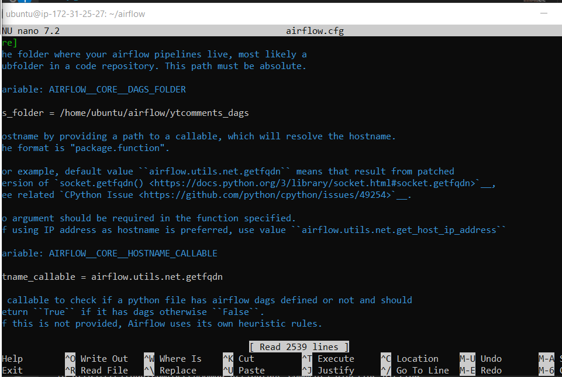

<!DOCTYPE html>
<html lang="en">
<head>
    <meta charset="UTF-8">
    <meta name="viewport" content="width=device-width, initial-scale=1.0">
</head>
<body>

<h1>YouTube Comments Pipeline with Airflow</h1>

This project demonstrates how to extract comments from a YouTube video using the YouTube API and Apache Airflow to automate the process.

<h2>Architecture Diagram</h2>

<h2>Steps for Setup and Execution</h2>

<h3>1. Acquire YouTube API Key</h3>

To extract comments from a YouTube video, you need to acquire a YouTube API key. Follow this guide to get your API key:

<ul>
    <li><a href="https://developers.google.com/youtube/v3/getting-started">YouTube API Guide</a></li>
</ul>
<h4>In the <code>youtube_comments.py</code> file assign the developer key to the DEVELOPER_KEY variable in the <code>seek_data()</code> function</h4>
<h3>Getting certificate to connect to EC2 via SSH</h3>

After getting your API key, download the keys file:

<h3>Configure Network traffic for your EC2 instance</h3>
Note that we are initially allowing the traffic from everywhere (from every Ip on the internet)

<h3>2. Connect to Airflow Instance via SSH</h3>

If you're using Windows, change the permissions of the .pem key pair file you downloaded. For assistance, you can follow this YouTube video:

<ul>
    <li><a href="https://www.youtube.com/watch?v=hDE3Io5CIbc&ab_channel=TapanDubey">Change PEM Permissions on Windows</a></li>
</ul>

<h3>3. Update Your Instance</h3>

Update your instance to ensure the latest packages are installed:

<pre><code>sudo apt update && sudo apt upgrade -y</code></pre>

<h3>4. Install Required Dependencies</h3>

Airflow requires Python and some additional packages. Run the following command to install them:

<pre><code>sudo apt install -y python3-pip python3-venv libpq-dev</code></pre>

<h3>5. Create a Virtual Environment</h3>

To avoid interfering with the system Python environment, create a virtual environment for Airflow:

<pre><code>python3 -m venv airflow-venv</code></pre>

Activate the virtual environment:

<pre><code>source airflow-venv/bin/activate</code></pre>

<h3>6. Install Apache Airflow</h3>

Install Apache Airflow within the virtual environment:

<pre><code>pip install apache-airflow</code></pre>

<h3>7. Verify Airflow Installation</h3>

To ensure Airflow is installed correctly, run:

<pre><code>airflow version</code></pre>

<h3>8. Install Required Libraries</h3>

Next, install the necessary libraries as per the commands provided in the <code>yt_etl.ssh</code> file. You can refer to these images for the installation process:

<h3>9. Install Libraries in the Virtual Environment</h3>

For example, to install <code>pandas</code> and other dependencies, run:

<pre><code>pip install pandas</code></pre>

For reference, see the screenshots:

<h3>10. Start Airflow Server</h3>

Run the command to start the Airflow webserver:

<pre><code>airflow standalone</code></pre>

<h3>11. Airflow Not Running? Check Security Group</h3>

If Airflow isn't running, you might need to update the security group of your instance. Go to:

<ul>
    <li>Instance → Security → Edit Inbound Rules</li>
    <li>Add a rule with <strong>Type: All traffic</strong>, <strong>Protocol: Anywhere</strong>, or use <strong>MyIP</strong>.</li>
</ul>

Allow all traffic and IPv4 anywhere.

<h3>12. Access Airflow Web UI</h3>

Use the public IPv4 DNS to access the Airflow UI. The URL will look like this:

<pre><code>ec2-51-20-131-224.eu-north-1.compute.amazonaws.com:8080</code></pre>

Use <code>:8080</code> to access the Airflow UI.

<h3>13. Create an Airflow Admin User</h3>

If you can’t find the username and password in your Airflow logs, you can create a new user by running:

<pre><code>flask fab create-admin --username areeb02 --firstname areebb --lastname ahmad --email admin11@example.com --password admin</code></pre>

This will allow you to log into the Airflow UI.

<h3>14. Configure Airflow DAG Folder</h3>

On your Airflow instance, go to the <code>/airflow</code> directory and open the <code>airflow.cfg</code> file:

<pre><code>sudo nano airflow.cfg</code></pre>

Change the <code>dags_folder</code> path to the <code>yt_comments_dag</code> (or the folder relevant to your project). It should look something like this:

<h3>15. Copy Files to DAG Folder</h3>

Use the following commands to copy your project files into the <code>yt_comments_dags</code> folder.

<pre><code>sudo nano &lt;filename&gt;</code></pre>

Refer to the screenshots for file details:

<h3>16. Check Airflow UI</h3>

Go to the Airflow UI and ensure that the folder name in <code>airflow.cfg</code> matches the DAG folder name. Your DAG should now appear.

<h3>17. IAM Role Setup for S3 Bucket Access</h3>

If your DAG fails because of a missing IAM role for S3 access, follow these steps:

<ol>
    <li>Choose the instance you want to attach the IAM role to.</li>
    <li>Select <strong>Actions → Security → Modify IAM role</strong>.</li>
    <li>Select the IAM instance profile and click <strong>Update IAM role</strong>.</li>
    <li>Create an IAM role with <strong>Full S3 bucket permissions</strong>.</li>
</ol>

<h3>18. Refresh Airflow UI and Check Logs</h3>

After refreshing the Airflow UI, the DAG should now appear, and you can check the logs for the execution details.

<h3>19. Verify CSV Upload to S3 Bucket</h3>

Finally, ensure that the CSV file has been successfully uploaded to the specified S3 bucket.

</body>
</html>
